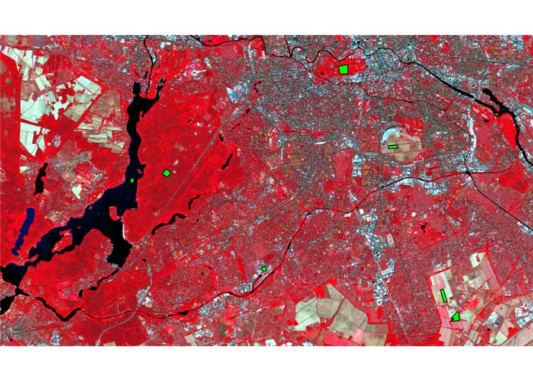
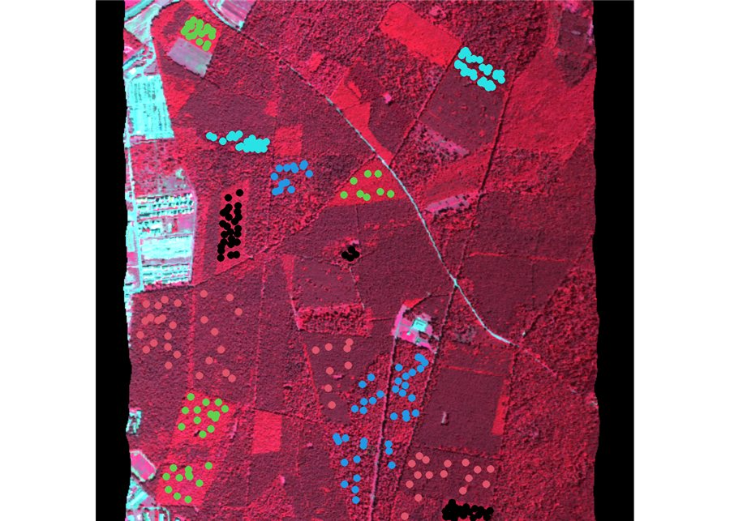
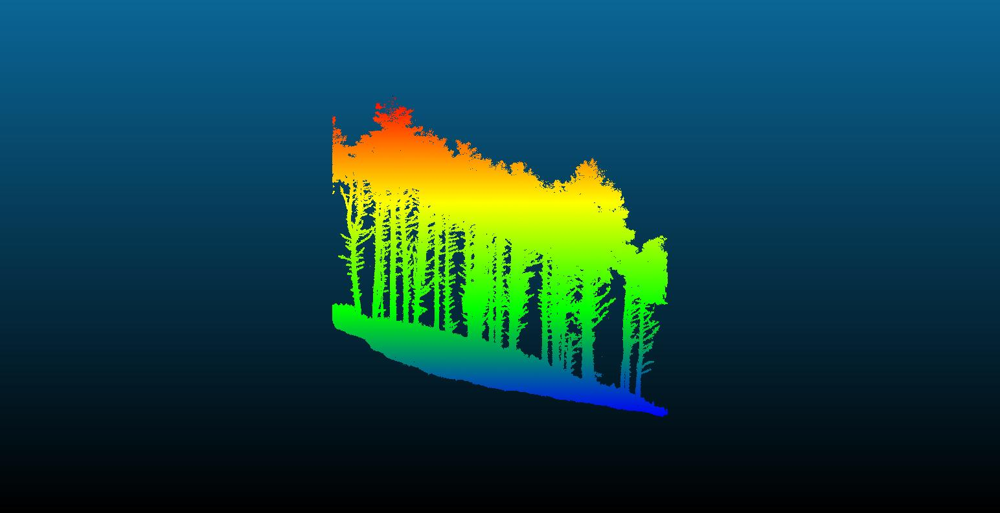
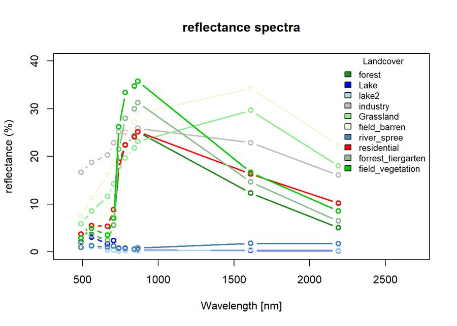
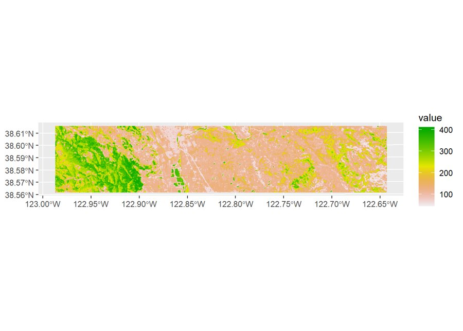

# Advanced Remote Sensing & Geomatics – Exercises


A collection of my solutions to the exercises of the master course **Advanced Remote Sensing and Geomatics**
(winter term 2023/24). The exercises cover the full chain from raw geodata to thematic maps:
terrain analysis, multispectral and hyperspectral image analysis, machine-learning classification
and regression, and airborne / terrestrial LiDAR processing – mostly in **R**, complemented by **QGIS** and **CloudCompare**.

<p align="center">
  
  
  
</p>

## Skills demonstrated

| Area | Methods / tools |
|---|---|
| Raster & vector GIS | `terra`: cropping, reprojection, zonal statistics, map algebra, raster ↔ vector extraction |
| Terrain analysis | SRTM DEM, slope / aspect, reclassification, hillshade, elevation–temperature regression |
| Multispectral RS | Sentinel-2 L1C/L2A preprocessing (`sen2r`), spectral signatures, feature spaces, NDVI / EVI / PVI |
| Hyperspectral RS | HyMap & EnMAP data, spectral libraries, SVM and random forest (hyper-parameter tuning, CV) |
| Machine learning | Tree-species classification, above-ground biomass regression, variable importance |
| Airborne LiDAR | `lidR`: ground classification (CSF), DTM/DSM/CHM, individual tree detection & segmentation, area-based metrics |
| Terrestrial LiDAR | CloudCompare + 3DFin: stem detection, DBH and tree height estimation |
| Desktop GIS | QGIS: digitizing training data on 20 cm true orthophotos, map projects |

## Exercises

| # | Exercise | Topic | Data | Tools |
|---|---|---|---|---|
| 01 | [R fundamentals](exercises/01-r-fundamentals) | R basics, data frames, climate normals & t-test | DWD station data | R |
| 02 | [DEM terrain analysis](exercises/02-dem-terrain-analysis) | Slope, aspect & elevation classes (Guelb er Richat, Black Forest) | SRTM 1″ | `terra` |
| 03 | [Temperature vs. elevation](exercises/03-temperature-elevation-regression) | Linear regression, raster interpolation, zonal statistics per municipality | SRTM, DWD, ALKIS | `terra`, QGIS |
| 04 | [Sentinel-2 preprocessing](exercises/04-sentinel2-preprocessing) | SAFE → GeoTIFF, subsetting, RGB / false-colour composites | Sentinel-2 | `sen2r`, `terra`, QGIS |
| 05 | [Spectral indices & land cover](exercises/05-spectral-indices-landcover) | Spectral signatures, feature spaces, NDVI / EVI / PVI | Sentinel-2 | `terra` |
| 06 | [Hyperspectral tree species](exercises/06-hyperspectral-tree-species) | SVM & random forest classification of 5 tree species | HyMap (125 bands) | `e1071`, `randomForest` |
| 07 | [EnMAP biomass regression](exercises/07-enmap-biomass-regression) | Random forest regression of above-ground biomass | EnMAP (195 bands) | `randomForest`, `tidyterra` |
| 08 | [LiDAR DTM / CHM & tree segmentation](exercises/08-lidar-terrain-canopy-models) | DTM, DSM, CHM, local-maximum tree tops, Dalponte segmentation | Berlin ALS | `lidR` |
| 09 | [LiDAR metrics & forest stands](exercises/09-lidar-forest-stand-metrics) | Pixel- and tree-level metrics vs. forest inventory | Berlin ALS, forest stands | `lidR`, `ggplot2` |
| 10 | [TLS stem detection](exercises/10-tls-stem-detection) | DBH / height from terrestrial laser scanning | TLS pine stand | CloudCompare, 3DFin |
| 11–12 | [Land-cover digitizing](exercises/11-12-qgis-landcover-digitizing) | Training-data digitizing on RGB / CIR orthophotos | Berlin TrueDOP 20 cm | QGIS |

Rendered reports (no R needed): **[GitHub Pages](https://toihr.github.io/Advanced-Remote-Sensing-Exercises/)**

<p align="center">
  
  
  
</p>

## Getting started

The code is in this repository; the input data (~3.5 GB, mostly point clouds and imagery) is attached to the
[`data-v1.0` release](https://github.com/toihr/Advanced-Remote-Sensing-Exercises/releases/tag/data-v1.0)
and downloaded on demand with checksum verification.

```bash
git clone https://github.com/toihr/Advanced-Remote-Sensing-Exercises.git
cd Advanced-Remote-Sensing-Exercises
Rscript install_packages.R   # R packages used in the exercises
Rscript download_all.R       # all data – or per exercise, see below
```

Per exercise: open the `.Rproj` in the exercise folder and run `source("get_data.R")`.
Without R: `tools/download_data.sh exercises/<name>` (Linux/macOS) or `.\tools\download_data.ps1 exercises\<name>` (Windows).

## Repository layout

```
exercises/<nn-name>/
├── README.md            task, methods, results
├── *.R / *.Rmd / *.qgz  scripts, reports, QGIS projects
├── data/                input data (large files come from the release)
├── data-manifest.csv    which release assets belong to this exercise
└── get_data.R           downloads them
tools/                   download helpers (R, bash, PowerShell) and release build script
docs/                    rendered HTML reports (GitHub Pages)
```

## Data & license

Code: [MIT](LICENSE). Data belongs to the respective providers – see [DATA.md](DATA.md) for sources and terms.
Exercise tasks were set by the course; the solutions are my own work.
