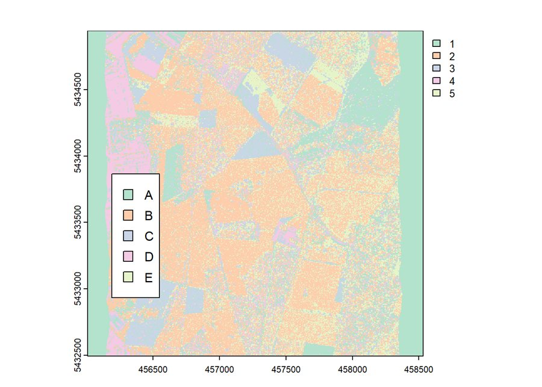

# 06 – Hyperspectral tree-species classification

Report: [`tree_species_classification.Rmd`](tree_species_classification.Rmd) · [rendered HTML](https://toihr.github.io/Advanced-Remote-Sensing-Exercises/06-hyperspectral-tree-species.html)

HyMap airborne imagery (125 bands) of a forest near Karlsruhe with reference points of five species
(*Quercus robur, Pinus sylvestris, Quercus rubra, Fagus sylvatica, Pseudotsuga menziesii*):
- class-wise mean spectra ± standard deviation,
- **SVM** (radial kernel) with grid search over γ and C and 5-fold cross-validation (`e1071::tune`),
- **random forest** with `tuneRF`, class probabilities vs. hard classification, max-probability map and majority vote.

